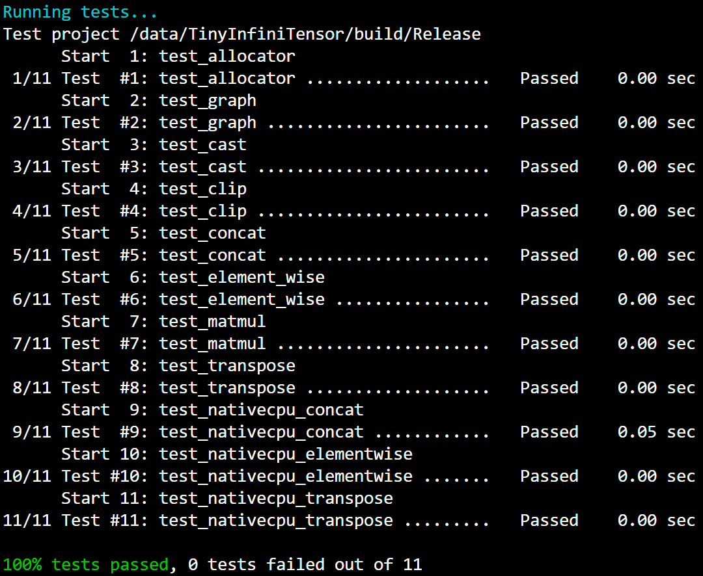

# TinyInfiniTensor 作业报告

## 一、开发环境和总体结果

本次作业在 Linux Docker 容器中完成，项目使用 CMake 和 GNU Make 构建，C++ 标准为 C++17。运行时后端为项目提供的 `NativeCpuRuntimeObj`。

最终 11 个测试全部通过，包括基础设施、算子形状/类型推导，以及 CPU kernel 的端到端测试。



## 二、作业步骤

### 作业一：内存分配器和计算图内存规划

难度：⭐⭐⭐⭐

对应测例：`test_allocator`、`test_nativecpu_concat`、`test_nativecpu_elementwise`、`test_nativecpu_transpose`。

对应文件：`include/core/allocator.h`、`src/core/allocator.cc`、`src/core/graph.cc`。

#### 实现思路

本项目将内存管理分成两个层次。`Allocator::alloc` 并不真的申请内存，而是返回一段内存的逻辑偏移量；它需要在整张图的执行过程中模拟 Tensor 的分配、释放和复用。`Runtime::alloc` 才负责真正调用 CPU 的 `calloc`，一次性申请大小为峰值 `peak` 的连续内存。

我在 `Allocator` 中增加了按起始 offset 排序的空闲块表：

```cpp
std::map<size_t, size_t> freeBlocks;
```

key 是空闲块起始地址，value 是块大小。分配时先按地址顺序寻找第一个足够大的空闲块；找到后从空闲表移除，若块比请求空间大，则将剩余部分重新放回表中。找不到可复用块时，从 `peak` 末尾继续分配。

所有请求先通过 `getAlignedSize` 向上对齐到 8 字节。这里对齐的目的不是改变 Tensor 的逻辑字节数，而是确保下一个 Tensor 的 `base + offset` 仍适合存放 `uint64_t`、`double` 等需要较高对齐的类型。分配和释放都必须使用相同的对齐规则，否则空闲块的边界会不一致。

释放时先在 `freeBlocks` 中寻找前后相邻块：

```text
前一个空闲块紧贴当前块  -> 合并
后一个空闲块紧贴当前块  -> 合并
合并后刚好到达 peak     -> 直接回退 peak
否则                     -> 将合并块放回 freeBlocks
```

在 `GraphObj::dataMalloc` 中，调用 `topo_sort`，随后按拓扑顺序模拟每个算子的执行。所有图输入 Tensor 会在 `runtime->run` 前由测试代码调用 `setData` 写入，因此它们必须一开始就分配，不能等到遇到消费者时才分配。对每个 Tensor 记录 offset 和剩余消费者数量；当前算子使用完某输入后，消费者数量减一，减到零时将该 Tensor 的逻辑空间归还给 `Allocator`。

模拟结束后调用一次：

```cpp
auto *base = static_cast<char *>(allocator.getPtr());
```

最后将每个 Tensor 绑定为：

```cpp
tensor->setDataBlob(
    make_ref<BlobObj>(runtime, static_cast<void *>(base + offset)));
```

其中 `base` 是整块真实内存的首地址，`offset` 是规划阶段得到的逻辑偏移。`BlobObj` 保存 Runtime 和具体地址，Tensor 后续可通过它取得 `float *` 或 `uint32_t *`。

#### 遇到的问题

一开始容易把 `Allocator::alloc` 和 `Runtime::alloc` 当成同一个函数。实际二者没有继承关系：前者返回 `size_t offset`，后者返回 `void *`。前者决定“Tensor 放在这块大内存的哪里”，后者决定“在当前设备上申请多少真实内存”。

另一个容易遗漏的点是释放尾部块时回退 `peak`。如果只把最后一块插入 `freeBlocks`，后续较大的请求会从旧 `peak` 之后继续增长，`testAllocWithEndFreeBlock` 就无法复用末尾地址。

### 作业二：Transpose 算子形状推导

难度：⭐

对应测例：`test_transpose`、`test_nativecpu_transpose`。

对应文件：`src/operators/transpose.cc`。

#### 实现思路

Transpose 的 `permute` 是在构造算子时由调用者传入的属性，不由 `inferShape` 推导。若输入 shape 为 `inputDim`，排列为 `permute`，输出规则是：

```cpp
outputDim[i] = inputDim[permute[i]];
```

例如：

```text
input  = [1, 2, 3, 4]
perm   = [0, 2, 1, 3]
output = [1, 3, 2, 4]
```

实现中检查排列长度与 rank 一致、每个轴在合法范围内，并使用 `vector<bool> used` 检查轴不重复。空 `permute` 的分支原先直接用下标写空 vector，因此先 `resize(rank)` 再填写 identity 排列，避免越界。

#### 遇到的问题

无

### 作业三：Clip 算子形状推导

难度：⭐

对应测例：`test_clip`。

对应文件：`src/operators/unary.cc`。

#### 实现思路

Clip 对每个元素进行上下界截断：

```text
output[i] = min(max(input[i], minValue), maxValue)
```

它不改变元素数量、rank、维度或默认 dtype，因此形状推导只需返回输入 shape：

```cpp
IT_ASSERT(inputs.size() == 1);
return {{inputs[0]->getDims()}};
```

外层的双大括号分别对应“一个输出 shape”和 `optional<vector<Shape>>` 的包装。

#### 遇到的问题

无

### 作业四：Cast 算子形状和类型推导

难度：⭐⭐

对应测例：`test_cast`。

对应文件：`src/operators/unary.cc`。

#### 实现思路

Cast 的形状与输入保持一致，变化的是 dtype。项目已有：

```cpp
DataType CastObj::getOutputDataType() const;
```

该函数已经把 `CastType` 映射到目标 `DataType`，例如 `Float2Float16` 对应 `DataType::Float16`。因此 `inferDataType` 不重复写 `switch`，只返回一个输出类型：

```cpp
return {getOutputDataType()};
```

而 `inferShape` 与 Clip 一样直接返回输入 shape。

#### 遇到的问题

无

### 作业五：Concat 算子形状推导

难度：⭐⭐

对应测例：`test_concat`、`test_nativecpu_concat`。

对应文件：`src/operators/concat.cc`。

#### 实现思路

Concat 的输出 shape 以第一个输入为基础。遍历剩余输入时：

```text
rank 必须一致
dtype 必须一致
非拼接轴必须相等
拼接轴长度累加
```

项目构造函数已经通过 `get_real_axis` 将负轴转成非负轴，因此形状推导只需确认 `dim` 在 `[0, rank)` 内。

例如：

```text
[1, 3, 2, 4]
[1, 3, 2, 5]
axis = 3
----------------
[1, 3, 2, 9]
```

#### 遇到的问题

一开始如果直接返回第一个输入的 `dims`，`test_concat` 会给出很直观的失败：

```text
实际： [1, 3, 2, 4]
期望： [1, 3, 2, 9]
```

另一个常见错误是把拼接轴写成赋值：

```cpp
outputDims[dim] = inputDims[dim];
```

这会覆盖前面输入的长度。正确操作是 `+=`。同时不能忽略非拼接轴检查，否则 `[2, 3, 4]` 与 `[2, 5, 6]` 沿 axis 1 会被错误接受。

### 作业六：双向广播

难度：⭐⭐⭐

对应测例：`test_element_wise`、`test_nativecpu_elementwise`、`test_matmul`。

对应文件：`src/utils/operator_utils.cc`。

#### 实现思路

广播从 shape 尾部对齐。对每一对维度 `a`、`b`：

```text
a == b       -> 输出该维为 a
a == 1       -> 输出该维为 b
b == 1       -> 输出该维为 a
其他情况     -> 不可广播
```

遍历时使用 `i = 0` 表示最后一维：

```cpp
const int dimA = i < A.size() ? A[A.size() - 1 - i] : 1;
const int dimB = i < B.size() ? B[B.size() - 1 - i] : 1;
```

当一侧 shape 已经没有更多高位维度时，将它视作 1。这样标量 shape `{}` 可以与任意 shape 广播，`[5]` 可以与 `[2, 3, 4, 5]` 广播。

因为读取是从尾向前，结果也写入 `outputShape[outputRank - 1 - i]`，最终 shape 仍保持正常的从左到右顺序。

#### 遇到的问题

无

### 作业七：MatMul 形状推导

难度：⭐⭐⭐

对应测例：`test_matmul`。

对应文件：`src/operators/matmul.cc`。

#### 实现思路

本项目测试只覆盖 rank 不小于 2 的矩阵输入。将最后两个维度视为矩阵维：

```text
A = [..., M, K]
B = [..., K, N]
C = [..., M, N]
```

前面的 `...` 是 batch 维度，使用作业六的 `infer_broadcast` 合并。

`transA` 和 `transB` 只解释最后两维，不影响 batch 维。实现时先根据两个 flag 得到逻辑上的 `m`、`kA`、`kB`、`n`，检查 `kA == kB`，再将广播后的 batch shape 追加 `m` 和 `n`。同时更新 `MatmulObj` 的成员 `m`、`n`、`k`，便于 `toString` 和图优化使用。

例如：

```text
A = [2, 3, 5, 4], transA = true  -> 逻辑矩阵 [4, 5]
B = [1, 3, 2, 5], transB = true  -> 逻辑矩阵 [5, 2]
batch = broadcast([2, 3], [1, 3]) = [2, 3]
输出 = [2, 3, 4, 2]
```

#### 遇到的问题

这里最容易把 `transA` 和 `transB` 下的 K 维索引写反。`transA=true` 时物理 shape 最后两维是 `[K, M]`，而 `transB=true` 时是 `[N, K]`。

### 作业八：简单图优化

难度：⭐⭐⭐⭐

对应测例：`test_graph`。

对应文件：`src/core/graph.cc`。

#### 实现思路

此作业实现两条规则。

第一条规则删除相邻的互逆 Transpose。若内层排列为 `first`，外层排列为 `second`，按本项目的语义有：

```text
最终输出第 i 维来自原输入第 first[second[i]] 维
```

因此对每个 i 检查：

```cpp
first[second[i]] == i
```

成立即说明两次置换组合为 identity。删除前还要确认内层输出 `middle` 只有外层 Transpose 一个消费者，否则其他算子仍需要中间转置结果。

删除时将所有下游算子输入中的 `outer` 输出替换为 `inner` 输入：

```cpp
op->replaceInput(replaced, original);
```

然后删除两个 Operator 和两个中间 Tensor。

第二条规则识别 MatMul 输入前的“仅交换最后两维”的 Transpose。rank 为 4 时要求排列为：

```text
[0, 1, 3, 2]
```

rank 为 3 时是 `[0, 2, 1]`，rank 为 2 时是 `[1, 0]`。这种操作可由 MatMul 的 `transA` 或 `transB` 表达。将 MatMul 的输入改回 Transpose 前的 Tensor，并反转相应 flag：

```cpp
matmul->setTransA(!matmul->getTransA());
```

或：

```cpp
matmul->setTransB(!matmul->getTransB());
```

这里用逻辑非而不是直接设为 `true`，因为 MatMul 原本可能已经带转置属性，两次转置应相互抵消。

每次图重写后统一重建连接关系，而不是在多处手工增删边。重建步骤为：

```text
清空每个 Tensor 的 source/targets
清空每个 Operator 的 predecessors/successors
根据每个 Operator 的 outputs 建立 Tensor.source
根据每个 Operator 的 inputs 建立 Tensor.targets
根据 input.source 建立 predecessor/successor
```

最后重新拓扑排序、刷新 shape，并调用 `checkValid` 验证图不含悬空连接。

#### 遇到的问题

第一次实现 `rebuildConnections` 时，只清空了：

```cpp
tensor->targets.clear();
tensor->source.reset();
```

但忘记清空：

```cpp
op->predecessors.clear();
op->successors.clear();
```

此时前两个 Transpose 被删除后，MatMul 的 `predecessors` 仍保存指向已删除 Transpose 的 `weak_ptr`。运行 `test_graph` 时出现真实报错：

```text
C++ exception with description "bad_weak_ptr" thrown in the test body.
```

根因是 `getPredecessors()` 会把 `weak_ptr` 转为 `shared_ptr`；被删除 Operator 对应的弱引用已经过期，转换时抛出 `bad_weak_ptr`。在重建函数开头补上清空 Operator 双向边的循环后，再由最终 `ops` 和输入输出关系完整重建，`test_graph` 通过。

另一个容易犯的错误是把 `matmul->getInputs(i)` 当作 `TransposeObj`。它实际是 `Tensor`，必须先取其生产者：

```cpp
auto transpose = as<TransposeObj>(transposed->getSource());
```

`as<TransposeObj>` 内部使用 `std::dynamic_pointer_cast`。若输入是图输入、Add 输出或其他非 Transpose Tensor，该转换返回空指针，优化应跳过该输入，而不是强制转换。

## 三、总结

八个作业依次把一个计算图执行框架的关键链路补齐：算子 shape/dtype 推导决定输出 Tensor 元数据，广播和 MatMul 处理多维张量语义，Allocator 规划 Tensor 生命周期和内存复用，Runtime 负责真实 CPU 内存申请与 kernel 调度，图优化则在不改变计算结果的前提下重写连接关系。

同一张图需要同时维护了 Tensor 生产消费关系与 Operator 前驱后继关系。图重写时只更新其中一侧会留下悬空边；内存规划时需要同时考虑 Tensor 大小和生命周期，才能做到内存复用。
